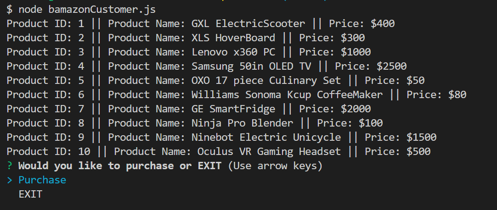
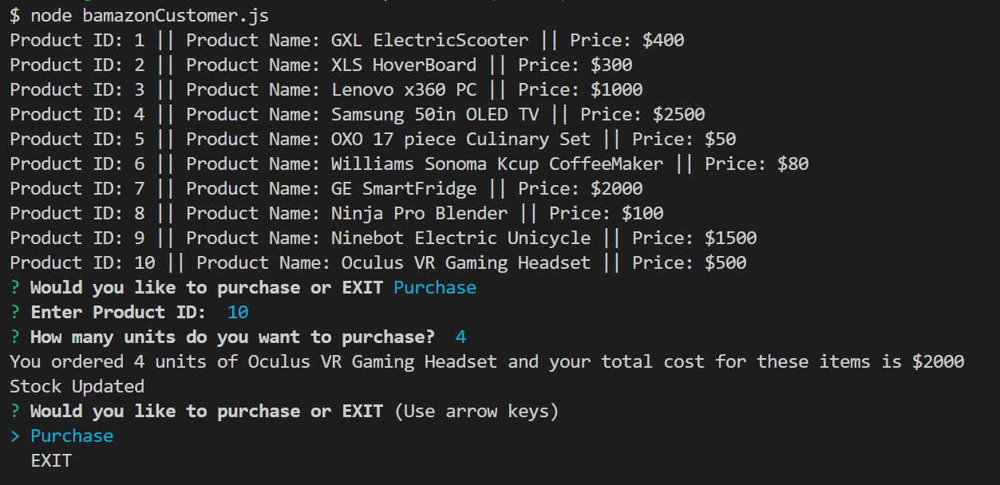
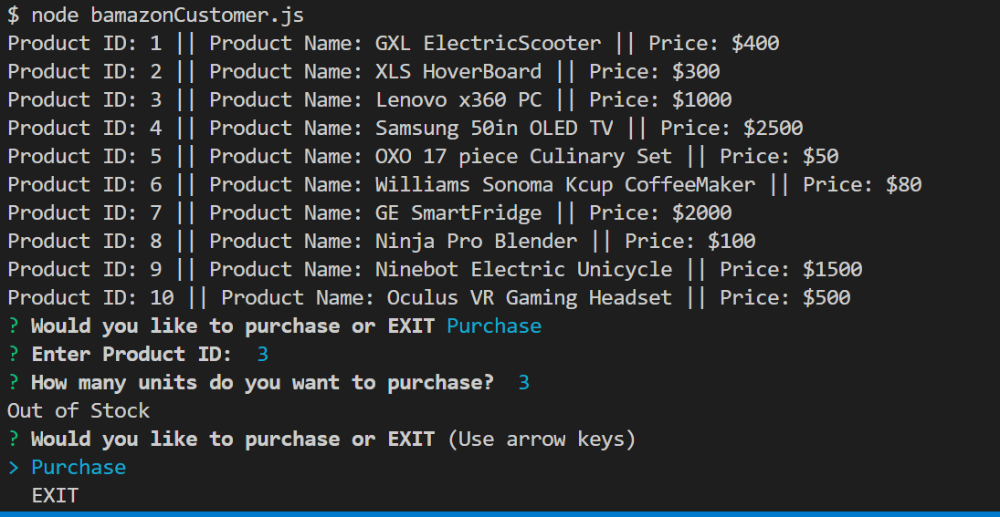
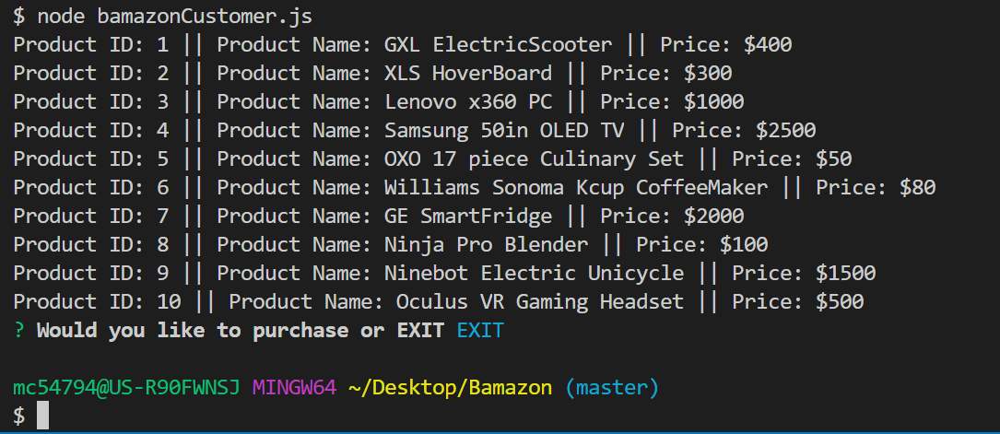

# Bamazon

This project is a command line Node application that creates an Amazon-like storefront that takes in orders from customers and depletes stock from the store's inventory.

## Overview
Installed required npm packages (**mysql, inquirer**) using npm install <npm package name>. Initialized `package.json` using `npm init -y`. Created a `.gitignore` file to exclude: `node_modules and .DS_Store`. Created a mySQL database containing a products table using mySQL Workbench. The products table contained 10 rows of data and had the following columns: item_id(primary key), product_name, department_name, price and stock_level. Used mysql.createConnection() to create connection information for the SQL database. Used connection.connect() to connect to the database and call showProducts() which displays all products in the products table. This app uses the inquirer package to prompt the customer to either Purchase or Exit. Choosing exit ends the database connection. Choosing Purchase calls BuySomething(). This function prompts the customer to select a product ID and how many units they would like to purchase. If there is a match on the product ID the customer selects and the item_id in the database, the stock level is checked. If the customer orders more than is available, the app displays "Out of stock". Otherwise, the units ordered is subtracted from the stock level and using an SQL statement, the products table is updated. The customer price is calculated and the total price is displayed to the customer. 

## How to use the app
The available products for sale is shown to the customer. If customer types: Exit, the connection to the database ends. If Purchase is selected, the customer chooses a product ID and how many units they would like to purchase. If there is enough stock, the customer is shown the total price for the items selected. If the stock is depleted, "Out of Stock" is displayed.

## Technologies used: 
Node.js  
JavaScript ES5   
npm packages (mysql and inquirer)
MySQL Workbench
MySQL server

## My role in app development
According to the project specifications, I created the code and tested the functionality of this application.

## Screenshots
  
  
 
  
